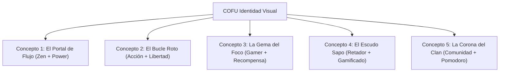

# COFU - Propuesta de Conceptos de Logotipo e Identidad Visual
**Director Creativo & Diseñador Senior de Logotipos**
*Agosto 2026*

---

---

## 🎯 Resumen Ejecutivo de Marca

Para crear una marca que resuene con el público de **COFU**, analizamos la psicología y el entorno de uso de nuestro cliente objetivo: **personas que pasan más de 8 horas frente a una pantalla** (desarrolladores, diseñadores, oficinistas y estudiantes universitarios) y que constantemente lidian con la fatiga mental y las distracciones digitales.

### Pilares de Identidad Visual de COFU:
1.  **Simplificación Vectorial Extrema (Inspiración Uber/Spotify/DiDi):** Elementos planos, de alto contraste, de fácil lectura a tamaños pequeños, optimizados para pantallas OLED y modo oscuro.
2.  **Geometría Retadora e Intuitiva:** Rechazamos el clasicismo rígido e industrial (como el de BMW/Toyota). Preferimos formas fluidas basadas en círculos o vectores cortados con precisión matemática.
3.  **Aura Gamer/Zen:** Un balance entre el "modo de enfoque" y el "modo de juego" (gamificación).

---

## 🎨 Los 5 Conceptos de Logotipo

---

### Concepto 1: El Portal de Flujo (The Flow Portal)
*Unión del símbolo de encendido digital (Power) con la simplicidad de un portal zen.*

*   **Idea visual central y significado simbólico:** El logo consta de una letra **"C"** geométrica y gruesa que abraza a un círculo central flotante. La "C" está abierta hacia la derecha con un ángulo de 45 grados, emulando tanto el botón de "Power/Encendido" de una consola gamer como la transición de entrar a un portal. El punto en el centro representa al usuario en su estado de concentración pura (Focus).
*   **Lenguaje de formas:** **Geométrico puro.** Basado en círculos concéntricos y cortes angulares limpios. Transmite orden, tecnología y una transición clara entre la distracción y el trabajo.
*   **Dirección tipográfica:** **Sans-serif geométrica pesada.** Tipos personalizados con esquinas ligeramente suavizadas en la parte exterior y rectas en el interior para reflejar la solidez del portal.
*   **Impresión emocional inmediata:** Enfoque, activación, precisión y control del entorno.
*   **Conexión con el público objetivo:** Los programadores y gamers asocian de inmediato el portal/botón de encendido con la acción de arrancar un reto. Les desafía a "encender" su cerebro.
*   **Escalabilidad:**
    *   *Icono app móvil:* El isotipo (la C con el punto) es perfectamente autocontenido y funciona de forma increíble en 1:1 sobre fondo negro.
    *   *Tarjeta de presentación / Firma:* La tipografía COFU junto al símbolo se ve limpia y tecnológica.
    *   *Vallas publicitarias:* La giga-escala destaca el contraste de la geometría sin perder legibilidad.
*   **Atemporalidad:** Basado en formas circulares clásicas y el símbolo universal de la energía/portal. No depende de modas de degradados o efectos 3D.

---

### Concepto 2: El Bucle Roto (The Broken Loop)
*La representación física de interrumpir la procrastinación.*

*   **Idea visual central y significado simbólico:** Una sola línea continua y gruesa que dibuja un círculo perfecto, pero que se ve interrumpida abruptamente en el cuadrante superior derecho por un vector diagonal que sale disparado hacia adelante (una flecha de avance minimalista). Simboliza romper el bucle infinito de abrir pestañas y procrastinar para pasar a la acción.
*   **Lenguaje de formas:** **Abstracto-Geométrico lineal.** Líneas de grosor uniforme con terminaciones angulares marcadas. Es dinámico y sugiere velocidad.
*   **Dirección tipográfica:** **Sans-serif humanista.** Letras ligeramente estilizadas que transmiten modernidad tecnológica pero con trazos que invitan a la comunidad.
*   **Impresión emocional inmediata:** Impulso, ruptura de hábitos dañinos, dinamismo y liberación.
*   **Conexión con el público objetivo:** El oficinista o estudiante que lleva horas atrapado en un ciclo infinito de redes sociales se siente identificado con el concepto físico de "romper el bucle" y avanzar.
*   **Escalabilidad:**
    *   *Icono app móvil:* Se reduce a un favicon de 16px sin perder el detalle del vector que rompe la circunferencia.
    *   *Tarjeta de presentación:* Se puede usar en relieve ciego (embossing) sobre papel mate oscuro, viéndose ultra-premium.
    *   *Vallas publicitarias:* El contraste de la flecha rompiendo el círculo captura la vista del conductor cansado en el tráfico.
*   **Atemporalidad:** El concepto de la flecha y el bucle es tan universal como el signo de "play" o "avance".

---

### Concepto 3: La Gema del Foco (The Focus Prism)
*Un emblema de logro para el "Guerrero del Enfoque".*

*   **Idea visual central y significado simbólico:** Un hexágono o diamante geométrico que, mediante líneas internas cruzadas en espacio negativo, revela una mirilla de francotirador o "crosshair" en el centro. Representa apuntar a tus metas y la satisfacción de desbloquear logros (gamificación).
*   **Lenguaje de formas:** **Geométrico poligonal / Low-poly.** Formas de ángulos agudos que recuerdan a la interfaz de un videojuego o a una gema/cristal que se ha de pulir (nuestro cerebro enfocado).
*   **Dirección tipográfica:** **Sans-serif de cortes angulares (Chamfered).** Tipografía robusta, de caja alta (mayúsculas), con cortes en las esquinas que imitan la estructura del diamante del logo.
*   **Impresión emocional inmediata:** Premium, de alta valía (estatus), precisión y espíritu competitivo/retador.
*   **Conexión con el público objetivo:** Conecta directamente con la mentalidad "gamer" de la comunidad. Los usuarios de computadoras ven el logo como una insignia o "insignia de clan" que quieren ganar y lucir en sus perfiles de LinkedIn.
*   **Escalabilidad:**
    *   *Icono app móvil:* El prisma se convierte en una gema interactiva que brilla al activar el temporizador Pomodoro.
    *   *Tarjeta de presentación:* Muy elegante al usar tintas metálicas mate sobre papel negro texturizado.
    *   *Vallas publicitarias:* Su forma poligonal clara destaca desde cualquier distancia.
*   **Atemporalidad:** Las gemas y polígonos limpios son pilares del diseño desde la Bauhaus. Su geometría básica asegura que no envejecerá.

---

### Concepto 4: El Escudo Sapo (The Mastered Toad / Shield)
*Basado en el famoso principio de productividad de Brian Tracy: "Trágate ese sapo" (Eat that frog).*

*   **Idea visual central y significado simbólico:** Una silueta minimalista y geométrica de la cabeza de un sapo/rana, resuelta en solo tres trazos circulares y un corte diagonal. La forma general emula la silueta de un escudo protector (El Escudo del Dojo contra las distracciones). Representa dominar la tarea más difícil del día ("el sapo") y proteger tu tiempo.
*   **Lenguaje de formas:** **Geométrico-orgánico estilizado.** Formas curvas simplificadas que le dan al sapo una apariencia moderna y amigable, similar al icono clásico de Spotify.
*   **Dirección tipográfica:** **Sans-serif redondeada en los extremos.** Tipografía suave y de bajo contraste pero de mucho peso para balancear la solidez del escudo.
*   **Impresión emocional inmediata:** Desafío lúdico, complicidad, protección y compañerismo.
*   **Conexión con el público objetivo:** Los lectores de productividad sonríen al captar la metáfora del "sapo", mientras que a los gamers les recuerda al icónico avatar de un juego de aventuras o "jefe de nivel" al que vencer todos los días.
*   **Escalabilidad:**
    *   *Icono app móvil:* Se convierte en un excelente avatar para la aplicación.
    *   *Tarjeta de presentación:* El sapo añade un tono relajado y retador que rompe con la monotonía corporativa.
    *   *Vallas publicitarias:* La silueta única destaca por encima de los logotipos puramente tipográficos tradicionales.
*   **Atemporalidad:** Los logotipos con mascotas abstractas (como el androide de Google o el pájaro de Twitter) se anclan en la mente del consumidor y evolucionan fácilmente con retoques menores de proporciones.

---

### Concepto 5: La Corona del Clan (The Crown of the Focus Clan)
*La unión del temporizador Pomodoro y la comunidad.*

*   **Idea visual central y significado simbólico:** Tres círculos o dots verticales alineados sobre un arco que simula la parte superior de un temporizador de arena o reloj clásico. La composición forma una corona minimalista de tres picos. Representa al "Clan de Concentración" (tres cabezas de usuarios enfocados juntos) y el valor del tiempo comunitario.
*   **Lenguaje de formas:** **Geométrico simple.** Formado únicamente por círculos y curvas simples. Es el más minimalista de los 5 conceptos.
*   **Dirección tipográfica:** **Sans-serif limpia y extendida (Wide).** Con un tracking (espaciado entre letras) generoso que transmite calma y profesionalidad premium, al estilo de marcas de lujo de software.
*   **Impresión emocional inmediata:** Comunidad, tranquilidad, soporte mutuo y estatus de élite.
*   **Conexión con el público objetivo:** Reduce la sensación de aislamiento del trabajador remoto o estudiante frente a la pantalla, recordándoles que forman parte de un "clan" con el mismo objetivo de superación.
*   **Escalabilidad:**
    *   *Icono app móvil:* Funciona como un sello o marca de agua icónica en las interfaces.
    *   *Tarjeta de presentación:* Se ve limpio, ejecutivo y pulcro.
    *   *Vallas publicitarias:* Extremadamente legible incluso a velocidades altas gracias a su holgura visual.
*   **Atemporalidad:** Es el concepto más indestructible ante el paso del tiempo, ya que reduce la identidad a su mínima expresión geométrica funcional.

---

## 🏆 El Veredicto del Director Creativo

Si **COFU** fuera mi propia marca, elegiría sin dudarlo el **Concepto 1: El Portal de Flujo (The Flow Portal)**.

### Razonamiento Detallado del Director Creativo:

1.  **Doble Metáfora Intuitiva (Zen + Gamer):** 
    Este logotipo no es solo un adorno; cuenta una historia en menos de medio segundo. Para un programador o estudiante agotado, la "C" abierta con el punto en el centro activa dos mapas mentales preexistentes:
    *   El botón de **Power/Encendido** (sé que al presionar aquí, inicio mi sesión de enfoque).
    *   El **Portal de Entrada** (sé que cruzo la línea entre el caos de las redes sociales y la tranquilidad de mi flujo de trabajo).

2.  **Alineación perfecta con Referencias Visuales:**
    Al igual que **Uber** o **Spotify**, este logo no utiliza gradientes complejos de color ni texturas metálicas anticuadas (que desagradan del estilo automotriz tradicional de BMW/Toyota). Es un diseño vectorial 100% plano, moderno e icónico. Utiliza esquinas rectas en su interior y curvas en el exterior, lo que crea una tensión visual muy atractiva que lo hace lucir contemporáneo pero con personalidad "gamer" sutil.

3.  **Optimizada para el Entorno del Usuario (Modo Oscuro & Pantallas):**
    El isotipo de la "C" y el punto central es perfecto para brillar en pantallas OLED con colores neón de alto contraste (como cian o verde fósforo sobre fondo negro). Es una marca nativa del entorno digital, justo el hábitat donde nuestro público objetivo pasa sus peores horas de procrastinación.

4.  **Flexibilidad de Marca:**
    Con el tiempo, la tipografía puede desaparecer y el isotipo del "Portal de Flujo" seguirá siendo reconocido por millones como el símbolo de la comunidad **COFU**. Es una marca diseñada para escalar de una pequeña startup a una plataforma global de hábitos.

---

## 🏁 Elección de Identidad de Marca Oficial

El cliente ha elegido formalmente el **Concepto 1: El Portal de Flujo (The Flow Portal)** como la identidad oficial de **COFU**.

### Isotipo Oficial:

El logotipo ha sido guardado y archivado dentro del directorio de assets del proyecto en [`public/assets/images/cofu_logo.jpg`](file:///C:/Users/ramiro.bahena/Desktop/Codes/RBAHENA/ProcrastinaComoUnPro/public/assets/images/cofu_logo.jpg) para su uso en la landing page, favicon y futuras aplicaciones móviles.
